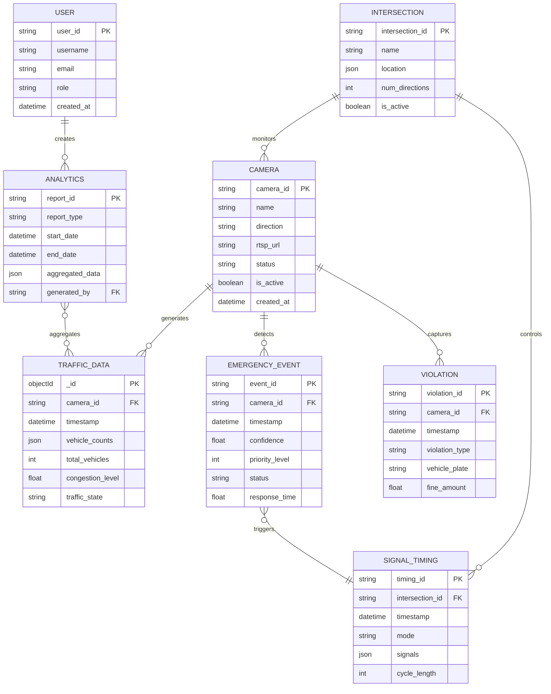
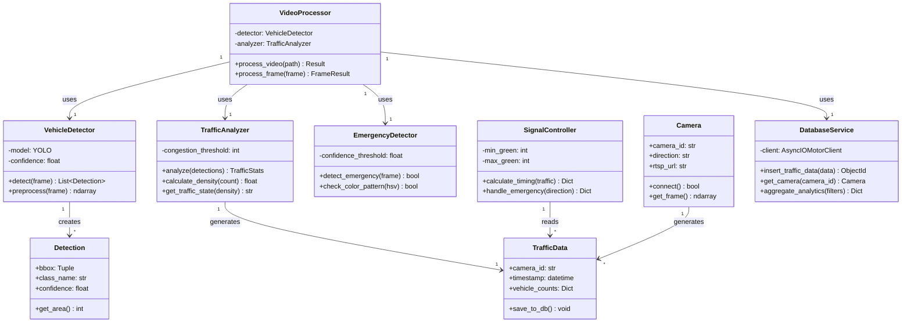
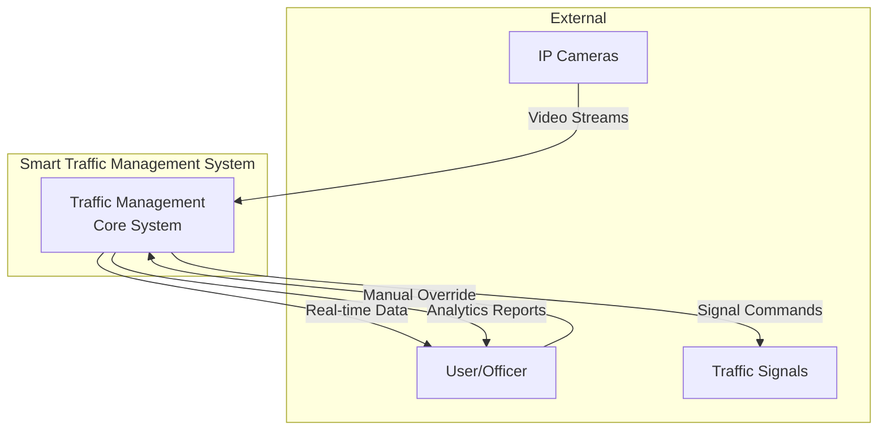
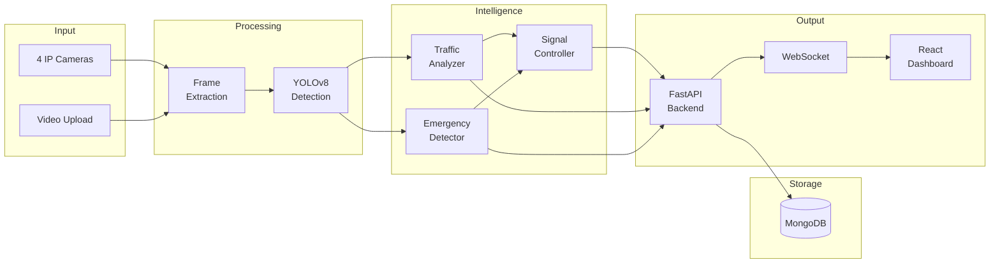
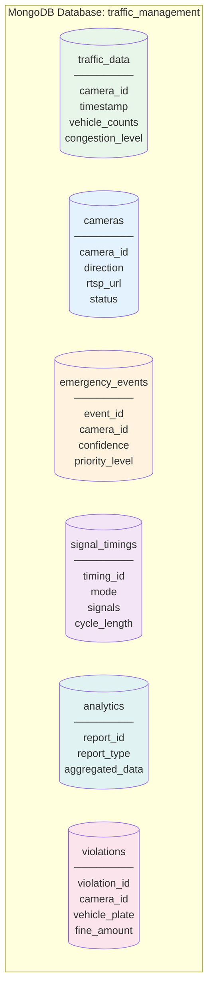
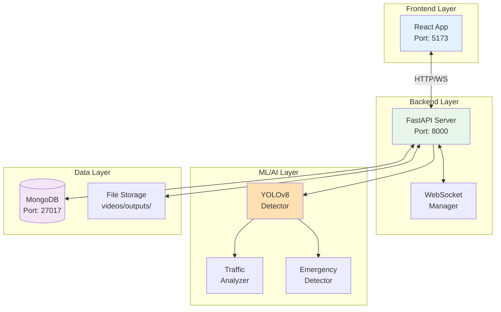
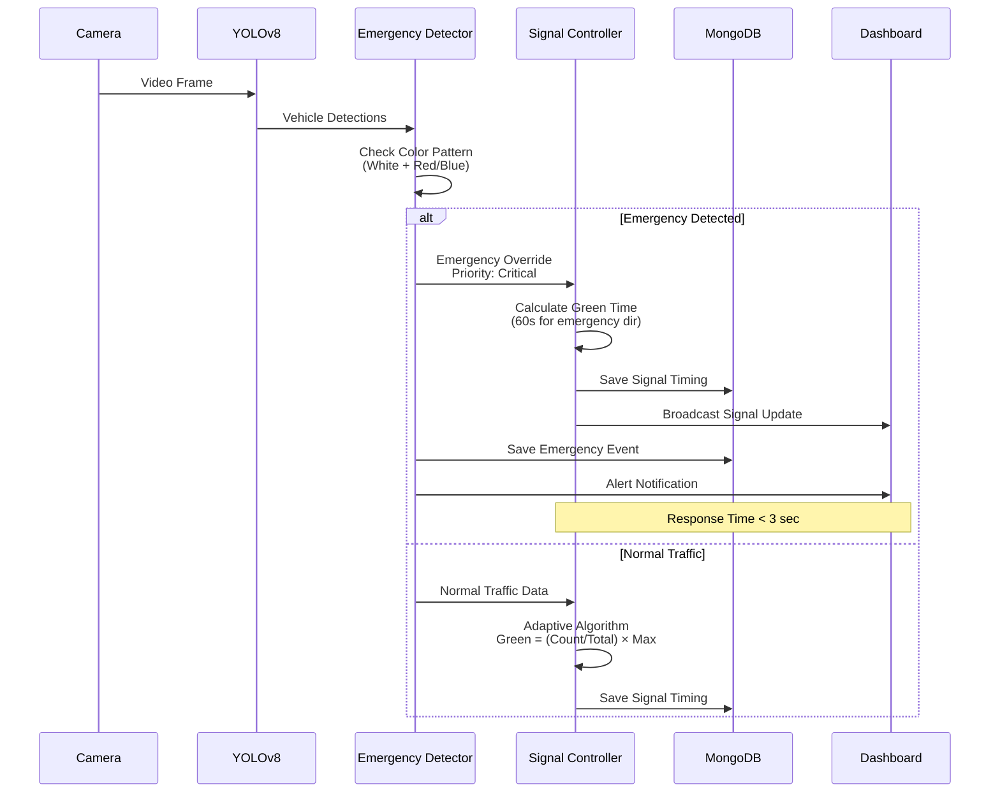
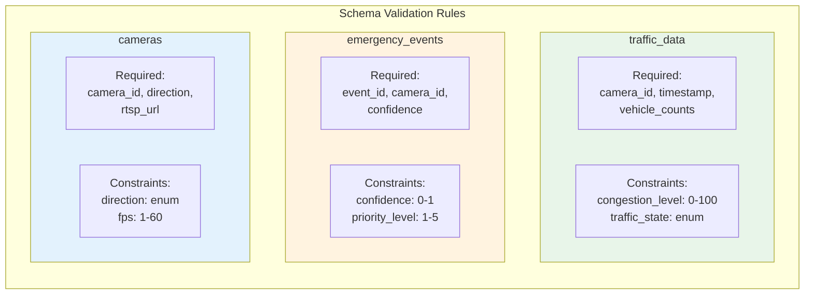

# Data Design Diagrams - Mermaid Format

## 3.6.1 Entity-Relationship Diagram (Simplified)



---

## 3.6.2 Class Diagram (Simplified)



---

## 3.6.3 Data Flow Diagram (Level 0 - Context)



---

## 3.6.4 Data Flow Diagram (Level 1 - Detailed)



---

## 3.6.5 Database Schema (MongoDB Collections)



---

## 3.6.6 System Component Diagram



---

## 3.6.7 Emergency Priority Flow



---

## 3.6.8 MongoDB Schema Validation Structure



---

## How to Use These Diagrams

### For Presentations:
1. **ER Diagram (3.6.1)** - Shows database relationships
2. **Class Diagram (3.6.2)** - Shows code architecture
3. **DFD Level 0 (3.6.3)** - Shows system context
4. **DFD Level 1 (3.6.4)** - Shows internal data flow

### For Documentation:
1. **Component Diagram (3.6.6)** - System layers overview
2. **Emergency Flow (3.6.7)** - Critical feature explanation
3. **Schema Validation (3.6.8)** - Database constraints

### For Development:
1. **Class Diagram** - Implementation reference
2. **MongoDB Collections (3.6.5)** - Database structure

### Rendering Options:
- **Online**: [Mermaid Live Editor](https://mermaid.live)
- **VS Code**: Install "Markdown Preview Mermaid Support" extension
- **GitHub**: Renders natively in markdown files
- **Documentation**: GitBook, Docusaurus support Mermaid

### Export:
```bash
# Using Mermaid CLI
npm install -g @mermaid-js/mermaid-cli
mmdc -i DATA_DESIGN_MERMAID.md -o diagrams.pdf
```
