# Smart Traffic Management System - Mermaid Diagrams

Complete set of system diagrams using Mermaid syntax for visualization.

---

## 1. USE CASE DIAGRAM

```mermaid
graph TB
    subgraph "Smart Traffic Management System"
        UC1[Monitor Live Traffic]
        UC2[View Analytics]
        UC3[Generate Reports]
        UC4[Override Signals]
        UC5[Respond to Emergency]
        UC6[Configure System]
        UC7[Manage Cameras]
        UC8[View Violations]
        
        UC9((Detect Vehicles))
        UC10((Analyze Traffic))
        UC11((Control Signals))
        UC12((Detect Emergency))
    end
    
    Officer[👮 Traffic Officer]
    Admin[👨‍💼 System Admin]
    System[🤖 Automated System]
    
    Officer --> UC1
    Officer --> UC2
    Officer --> UC3
    Officer --> UC4
    Officer --> UC5
    Officer --> UC8
    
    Admin --> UC6
    Admin --> UC7
    
    UC1 -.->|includes| UC9
    UC2 -.->|includes| UC10
    UC4 -.->|includes| UC11
    UC5 -.->|includes| UC12
    
    System --> UC9
    System --> UC10
    System --> UC11
    System --> UC12
    
    style Officer fill:#4A90E2
    style Admin fill:#E94B3C
    style System fill:#50C878
    style UC9 fill:#FFD700
    style UC10 fill:#FFD700
    style UC11 fill:#FFD700
    style UC12 fill:#FFD700
```



---

## 2. SEQUENCE DIAGRAM - Emergency Vehicle Detection

```mermaid
sequenceDiagram
    participant Camera as 📹 Traffic Camera
    participant Detector as 🧠 YOLOv8 Detector
    participant Emergency as 🚨 Emergency System
    participant Signal as 🚦 Signal Controller
    participant DB as 💾 MongoDB
    participant Dashboard as 📱 Dashboard
    
    Camera->>Detector: Video Frame (30 FPS)
    activate Detector
    Detector->>Detector: Run YOLO Detection
    Detector->>Detector: Classify Vehicles
    
    alt Emergency Vehicle Detected
        Detector->>Emergency: Emergency Vehicle Found
        activate Emergency
        Emergency->>Emergency: Verify Emergency (Color/Markings)
        Emergency->>Emergency: Calculate Priority
        Emergency->>Signal: Override Signal (Green 60s)
        activate Signal
        Signal->>Signal: Set Emergency Direction GREEN
        Signal->>Signal: Set Other Directions RED
        Signal-->>Emergency: Signal Changed
        deactivate Signal
        Emergency->>DB: Log Emergency Event
        Emergency->>Dashboard: Send Alert 🚨
        Dashboard-->>Dashboard: Show Notification
        deactivate Emergency
    else Normal Traffic
        Detector->>Signal: Traffic Count Data
        Signal->>Signal: Calculate Adaptive Timing
        Signal->>DB: Log Signal Timing
    end
    
    Detector-->>Camera: Request Next Frame
    deactivate Detector
```



---

## 3. SEQUENCE DIAGRAM - Video Upload & Processing

```mermaid
sequenceDiagram
    participant User as 👤 User
    participant Frontend as 🖥️ React Frontend
    participant API as 🔌 FastAPI Backend
    participant Processor as 🎬 Video Processor
    participant YOLO as 🧠 YOLOv8
    participant DB as 💾 MongoDB
    
    User->>Frontend: Upload Video File
    Frontend->>API: POST /api/v1/traffic/upload-video
    activate API
    API->>API: Validate File (MP4/AVI)
    API->>API: Create Job ID
    API-->>Frontend: Job ID & Status
    deactivate API
    
    Frontend->>Frontend: Poll for Status
    
    par Background Processing
        API->>Processor: Start Processing
        activate Processor
        loop Every Frame
            Processor->>YOLO: Detect Vehicles
            YOLO-->>Processor: Detections
            Processor->>Processor: Count Vehicles
            Processor->>Processor: Analyze Traffic
        end
        Processor->>Processor: Generate Statistics
        Processor->>DB: Save Results
        Processor-->>API: Processing Complete
        deactivate Processor
    end
    
    Frontend->>API: GET /api/v1/traffic/processing-status/{job_id}
    API-->>Frontend: Status: Completed ✅
    
    Frontend->>API: GET /api/v1/traffic/detection-results/{job_id}
    activate API
    API->>DB: Fetch Results
    DB-->>API: Detection Data
    API-->>Frontend: Results + Analytics
    deactivate API
    
    Frontend->>User: Display Results & Charts 📊
```



---

## 4. DATABASE DESIGN (ER DIAGRAM)


---

## 5. DEPLOYMENT DIAGRAM


---

## 6. BLOCK DIAGRAM - System Architecture

```mermaid
graph TB
    subgraph "INPUT LAYER"
        Cam1[📹 Camera 1<br/>1080p 30fps<br/>North Direction]
        Cam2[📹 Camera 2<br/>1080p 30fps<br/>South Direction]
        Cam3[📹 Camera 3<br/>1080p 30fps<br/>East Direction]
        Cam4[📹 Camera 4<br/>1080p 30fps<br/>West Direction]
    end
    
    subgraph "VIDEO PROCESSING LAYER"
        FrameExtract[🎬 Frame Extractor<br/>OpenCV<br/>Skip every 2nd frame]
        Preprocess[🔧 Preprocessor<br/>Resize & Normalize<br/>Color Conversion]
    end
    
    subgraph "AI DETECTION LAYER"
        YOLO[🧠 YOLOv8 Detector<br/>Confidence: 0.15<br/>7 Vehicle Classes]
        PostProcess[⚙️ Post-Processor<br/>NMS Filter<br/>Auto-Rickshaw Logic]
    end
    
    subgraph "INTELLIGENCE LAYER"
        TrafficAnalyzer[📊 Traffic Analyzer<br/>Count Vehicles<br/>Calculate Density]
        EmergencyDetector[🚨 Emergency Detector<br/>Color Analysis<br/>Priority Logic]
        SignalController[🚦 Signal Controller<br/>Adaptive Algorithm<br/>Timing Optimization]
    end
    
    subgraph "BACKEND SERVER LAYER"
        API[🔌 FastAPI Server<br/>REST Endpoints<br/>Port 8000]
        WebSocket[🔄 WebSocket<br/>Real-time Updates]
        Auth[🔐 Authentication<br/>JWT Tokens]
    end
    
    subgraph "DATA LAYER"
        MongoDB[(💾 MongoDB<br/>Traffic Data<br/>Emergency Events<br/>Analytics)]
        FileStore[📁 File Storage<br/>Videos<br/>Images<br/>Reports]
    end
    
    subgraph "PRESENTATION LAYER"
        ReactApp[⚛️ React Dashboard<br/>TypeScript + Vite<br/>TailwindCSS]
        LiveView[📺 Live Monitor<br/>Multi-Camera Grid]
        AnalyticsDash[📈 Analytics<br/>Charts & Reports]
    end
    
    subgraph "HARDWARE OUTPUT"
        SignalHW[🚦 Traffic Signals<br/>Physical Controllers<br/>GPIO/RS485]
    end
    
    %% Connections
    Cam1 --> FrameExtract
    Cam2 --> FrameExtract
    Cam3 --> FrameExtract
    Cam4 --> FrameExtract
    
    FrameExtract --> Preprocess
    Preprocess --> YOLO
    YOLO --> PostProcess
    
    PostProcess --> TrafficAnalyzer
    PostProcess --> EmergencyDetector
    
    TrafficAnalyzer --> SignalController
    EmergencyDetector -->|Override| SignalController
    
    SignalController --> API
    TrafficAnalyzer --> API
    EmergencyDetector --> API
    
    API --> MongoDB
    API --> FileStore
    API --> WebSocket
    Auth --> API
    
    WebSocket --> ReactApp
    MongoDB --> API
    
    API --> ReactApp
    ReactApp --> LiveView
    ReactApp --> AnalyticsDash
    
    SignalController -.->|Commands| SignalHW
    
    style Cam1 fill:#FF6B6B
    style Cam2 fill:#FF6B6B
    style Cam3 fill:#FF6B6B
    style Cam4 fill:#FF6B6B
    style YOLO fill:#EE4C2C
    style EmergencyDetector fill:#FFD700
    style MongoDB fill:#47A248
    style ReactApp fill:#61DAFB
    style SignalHW fill:#FF4500
```



---

## 7. DATA FLOW DIAGRAM (DFD) - Level 0


---

## 8. DATA FLOW DIAGRAM (DFD) - Level 1

```mermaid
graph TB
    Cameras[📹 Cameras]
    Officers[👮 Officers]
    
    subgraph Processes
        P1[P1: Detect<br/>Vehicles<br/>🧠 YOLOv8]
        P2[P2: Analyze<br/>Traffic<br/>📊 Analyzer]
        P3[P3: Check<br/>Emergency<br/>🚨 Detector]
        P4[P4: Adaptive<br/>Signal Control<br/>🚦 Controller]
        P5[P5: Emergency<br/>Priority<br/>⚡ Override]
        P6[P6: Store<br/>Data<br/>💾 Save]
        P7[P7: Generate<br/>Analytics<br/>📈 Reports]
        P8[P8: Update<br/>Dashboard<br/>🖥️ UI]
    end
    
    subgraph Data_Stores
        D1[(D1: YOLO Model<br/>Weights)]
        D2[(D2: MongoDB<br/>Database)]
    end
    
    Cameras -->|Video Frames| P1
    P1 <-->|Model| D1
    P1 -->|Detections| P2
    
    P2 -->|Traffic Stats| P3
    
    P3 -->|No Emergency| P4
    P3 -->|Emergency Found| P5
    
    P4 -->|Signal Timings| P6
    P5 -->|Emergency + Signals| P6
    
    P6 <-->|Read/Write| D2
    
    D2 -->|Historical Data| P7
    P7 -->|Reports| P8
    
    P8 -->|Dashboard Data| Officers
    Officers -->|Manual Override| P4
    
    style P1 fill:#EE4C2C
    style P3 fill:#FFD700
    style P5 fill:#FF4500
    style D2 fill:#47A248
```



---

## 9. ACTIVITY DIAGRAM - Emergency Vehicle Detection Flow

```mermaid
flowchart TD
    Start([🚀 Start<br/>Camera Active]) --> ReadFrame[📹 Read Video Frame]
    
    ReadFrame --> YOLODetect{🧠 YOLOv8<br/>Detect Vehicles}
    
    YOLODetect -->|Vehicles Found| CountVehicles[📊 Count Vehicles<br/>by Type]
    YOLODetect -->|No Vehicles| WaitNext[⏱️ Wait for<br/>Next Frame]
    
    CountVehicles --> CheckEmergency{🚨 Check for<br/>Emergency Vehicle?}
    
    CheckEmergency -->|Found| ColorAnalysis[🎨 Color Analysis<br/>HSV Detection]
    CheckEmergency -->|Not Found| NormalFlow[➡️ Normal Traffic Flow]
    
    ColorAnalysis --> VerifyEmergency{✅ Verify<br/>White + Red/Blue?}
    
    VerifyEmergency -->|Confirmed| TriggerEmergency[🔴 TRIGGER EMERGENCY MODE]
    VerifyEmergency -->|False Positive| NormalFlow
    
    TriggerEmergency --> GetDirection[📍 Get Vehicle<br/>Direction]
    GetDirection --> OverrideSignal[🚦 Override Signal<br/>Emergency Direction → GREEN 60s<br/>Other Directions → RED]
    
    OverrideSignal --> LogEvent[💾 Log Emergency Event<br/>MongoDB]
    LogEvent --> SendAlert[🔔 Send Dashboard Alert<br/>WebSocket]
    SendAlert --> WaitClear[⏳ Wait for<br/>Vehicle to Clear<br/>60 seconds]
    
    WaitClear --> ResumeNormal[🔄 Resume Normal<br/>Adaptive Control]
    
    NormalFlow --> CalcDensity[📈 Calculate<br/>Traffic Density]
    CalcDensity --> AdaptiveAlgo[⚙️ Adaptive Algorithm<br/>Green Time Calculation]
    AdaptiveAlgo --> UpdateSignals[🚦 Update Signal Timings]
    UpdateSignals --> SaveData[💾 Save Traffic Data<br/>MongoDB]
    
    SaveData --> WaitNext
    ResumeNormal --> WaitNext
    WaitNext --> ReadFrame
    
    style Start fill:#50C878
    style TriggerEmergency fill:#FF4500
    style OverrideSignal fill:#FFD700
    style CheckEmergency fill:#4A90E2
    style VerifyEmergency fill:#FF6B6B
    style YOLODetect fill:#EE4C2C
```



---

## 10. ACTIVITY DIAGRAM - Video Upload & Processing

```mermaid
flowchart TD
    Start([👤 User Selects Video]) --> Upload[📤 Upload Video File<br/>POST /upload-video]
    
    Upload --> Validate{✅ Validate<br/>File Format?}
    
    Validate -->|Invalid| Error1[❌ Show Error<br/>Only MP4/AVI Allowed]
    Error1 --> End1([🔚 End])
    
    Validate -->|Valid| CreateJob[📋 Create Job ID<br/>Status: Pending]
    CreateJob --> SaveFile[💾 Save to<br/>File Storage]
    SaveFile --> ResponseUser[📨 Return Job ID<br/>to Frontend]
    
    ResponseUser --> StartBG[🚀 Start Background<br/>Processing]
    
    parallel FrontendPoll and BackendProcess
        FrontendPoll --> Poll[🔄 Frontend Polls<br/>Every 2 seconds]
        Poll --> CheckStatus{📊 Check Status}
        CheckStatus -->|Processing| Poll
        CheckStatus -->|Completed| FetchResults[📥 Fetch Results<br/>GET /detection-results]
        
        BackendProcess --> OpenVideo[🎬 Open Video File<br/>OpenCV]
        OpenVideo --> LoopFrames{🔁 More Frames?}
        
        LoopFrames -->|Yes| ExtractFrame[🖼️ Extract Frame<br/>Skip every 2nd]
        ExtractFrame --> YOLODetect[🧠 YOLOv8 Detection]
        YOLODetect --> CountVehicles[📊 Count Vehicles]
        CountVehicles --> AnalyzeTraffic[📈 Analyze Traffic<br/>Density & Congestion]
        AnalyzeTraffic --> LoopFrames
        
        LoopFrames -->|No| GenerateStats[📊 Generate Statistics<br/>Total Counts, Peak Times]
        GenerateStats --> SaveResults[💾 Save to MongoDB]
        SaveResults --> UpdateStatus[✅ Update Status<br/>Completed]
    end
    
    FetchResults --> DisplayUI[🖥️ Display Results<br/>Charts & Visualizations]
    DisplayUI --> End2([🎉 End - Success])
    
    style Start fill:#50C878
    style Error1 fill:#FF4500
    style YOLODetect fill:#EE4C2C
    style DisplayUI fill:#61DAFB
    style UpdateStatus fill:#FFD700
```

---

## 11. USER INTERFACE FLOWCHART

```mermaid
flowchart TD
    Start([🌐 Open Browser]) --> LoadApp[⚛️ Load React App<br/>http://localhost:5173]
    
    LoadApp --> ShowDashboard[🏠 Dashboard Home<br/>4-Way Intersection View]
    
    ShowDashboard --> MenuChoice{📋 Menu Selection}
    
    MenuChoice -->|Dashboard| LiveMonitor[📺 Live Intersection Monitor<br/>- 4 Camera Grid<br/>- Real-time Counts<br/>- Signal Status<br/>- Emergency Alerts]
    
    MenuChoice -->|Video Analysis| VideoUpload[📹 Video Analysis Page<br/>- Upload Video<br/>- Process File<br/>- View Results]
    
    MenuChoice -->|Cameras| CameraManage[🎥 Camera Management<br/>- Add/Edit Cameras<br/>- RTSP Configuration<br/>- Start/Stop Streams]
    
    MenuChoice -->|Analytics| AnalyticsPage[📊 Analytics Dashboard<br/>- Traffic Charts<br/>- Peak Hours<br/>- Vehicle Breakdown<br/>- Export Reports]
    
    MenuChoice -->|Emergency| EmergencyPage[🚨 Emergency Management<br/>- Active Emergencies<br/>- Event History<br/>- Response Times]
    
    MenuChoice -->|Settings| SettingsPage[⚙️ Settings<br/>- System Config<br/>- Thresholds<br/>- Signal Timings]
    
    LiveMonitor --> InteractLive{🖱️ User Action}
    InteractLive -->|Click Camera| ExpandView[🔍 Expand Camera View<br/>Full Screen]
    InteractLive -->|Emergency Alert| ShowAlert[🔔 Emergency Notification<br/>Modal Popup]
    InteractLive -->|Manual Override| OverrideModal[🎛️ Manual Signal Control<br/>Set Green Time]
    
    VideoUpload --> SelectVideo[📂 Select Video File]
    SelectVideo --> UploadProcess[⏳ Upload & Processing<br/>Progress Bar]
    UploadProcess --> ShowResults[📈 Detection Results<br/>- Vehicle Counts<br/>- Congestion Graph<br/>- Download Report]
    
    AnalyticsPage --> FilterData[🔎 Filter Options<br/>- Date Range<br/>- Camera<br/>- Report Type]
    FilterData --> ShowCharts[📊 Display Charts<br/>- Line Charts<br/>- Bar Charts<br/>- Heatmaps]
    ShowCharts --> ExportReport[💾 Export Report<br/>PDF or Excel]
    
    CameraManage --> AddCamera[➕ Add New Camera]
    AddCamera --> CameraForm[📝 Camera Form<br/>- Name<br/>- RTSP URL<br/>- Location<br/>- Direction]
    CameraForm --> SaveCamera[💾 Save Camera<br/>POST /cameras]
    SaveCamera --> RefreshList[🔄 Refresh Camera List]
    
    EmergencyPage --> FilterEmergency[🔍 Filter Emergencies<br/>- Date<br/>- Type<br/>- Status]
    FilterEmergency --> ShowEvents[📋 Emergency Events List<br/>- Timestamp<br/>- Vehicle Type<br/>- Response Time]
    
    ExpandView --> LiveMonitor
    ShowAlert --> LiveMonitor
    OverrideModal --> LiveMonitor
    ShowResults --> VideoUpload
    ExportReport --> AnalyticsPage
    RefreshList --> CameraManage
    ShowEvents --> EmergencyPage
    
    LiveMonitor --> MenuChoice
    VideoUpload --> MenuChoice
    CameraManage --> MenuChoice
    AnalyticsPage --> MenuChoice
    EmergencyPage --> MenuChoice
    SettingsPage --> MenuChoice
    
    style Start fill:#50C878
    style LoadApp fill:#61DAFB
    style ShowDashboard fill:#4A90E2
    style LiveMonitor fill:#FFD700
    style ShowAlert fill:#FF4500
    style ShowCharts fill:#9B59B6
```



---

## 12. COMPONENT INTERACTION DIAGRAM


---

## Usage Instructions

### How to View These Diagrams

1. **GitHub/GitLab**: Copy the Mermaid code and paste into markdown files. GitHub and GitLab render Mermaid automatically.

2. **Mermaid Live Editor**: 
   - Visit: https://mermaid.live/
   - Paste any diagram code
   - Export as PNG/SVG

3. **VS Code**: 
   - Install "Markdown Preview Mermaid Support" extension
   - Open this file in preview mode

4. **Documentation Sites**: 
   - MkDocs with mermaid2 plugin
   - Docusaurus with @docusaurus/theme-mermaid
   - Confluence with Mermaid plugin

### Customization

You can customize colors, styles, and layouts by modifying:
- `style NodeName fill:#HexColor` - Change node colors
- `stroke:#HexColor,stroke-width:4px` - Border styles
- Node shapes: `[]` (box), `()` (rounded), `{}` (diamond), `[()]` (stadium)

### Exporting Diagrams

**PNG Export**:
```bash
# Using mermaid-cli
npm install -g @mermaid-js/mermaid-cli
mmdc -i MERMAID_DIAGRAMS.md -o diagrams.png
```

**PDF Export**:
- Copy diagram to https://mermaid.live/
- Click "Actions" → "Export as PDF"

---

## Diagram Summary

| Diagram Type | Purpose | Best For |
|--------------|---------|----------|
| **Use Case** | Show system actors and interactions | Understanding system scope |
| **Sequence** | Show time-based message flow | Understanding process flow |
| **ER Diagram** | Show database structure | Database design & queries |
| **Deployment** | Show physical architecture | Infrastructure planning |
| **Block** | Show system components | High-level architecture |
| **DFD** | Show data transformations | Data flow understanding |
| **Activity** | Show process workflows | Algorithm visualization |
| **UI Flow** | Show user navigation | UX design & testing |

---

**Created**: November 27, 2024  
**Project**: Smart Traffic Management System  
**Format**: Mermaid Syntax  
**Compatible**: GitHub, GitLab, VS Code, Mermaid Live Editor
