# PlantUML Diagrams - Smart Traffic Management System

Simple, clean PlantUML diagrams for your project. Copy and paste into http://www.plantuml.com/plantuml/

---

## 1. 🔄 SEQUENCE DIAGRAM - Emergency Vehicle Detection

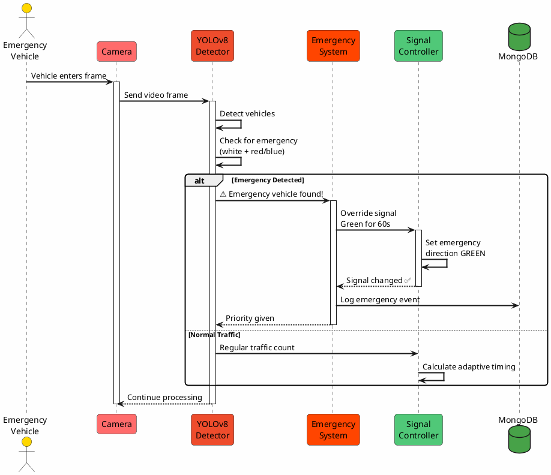

---

## 2. 🔄 SEQUENCE DIAGRAM - Video Upload & Analysis

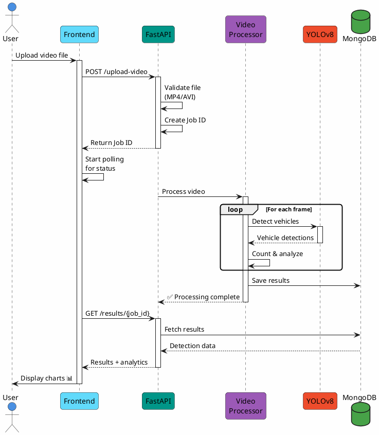

---

## 3. 👥 USE CASE DIAGRAM - System Interactions

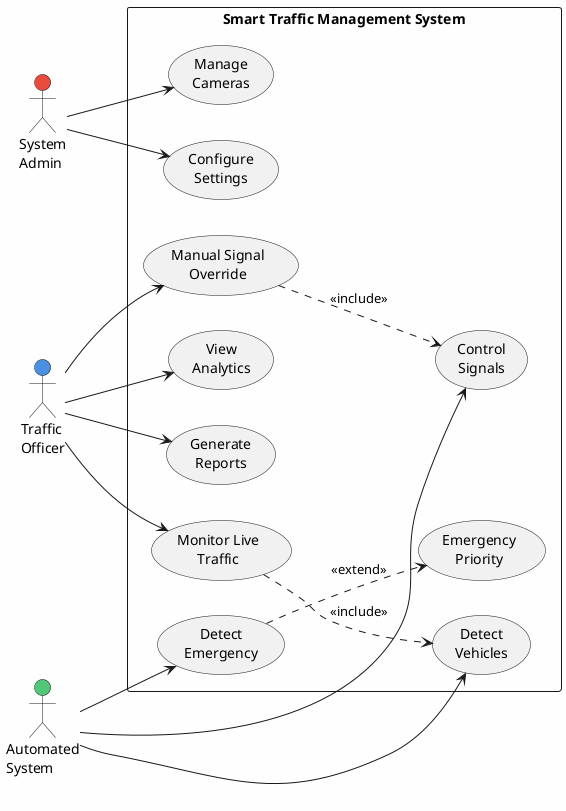

---

## 4. 📊 DATA FLOW DIAGRAM (DFD) - Level 0 (Context)

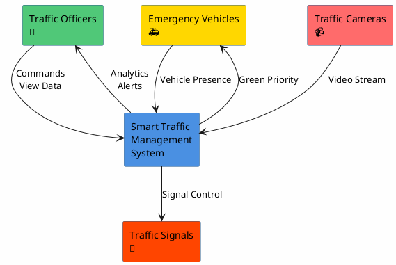

---

## 5. 📊 DATA FLOW DIAGRAM (DFD) - Level 1

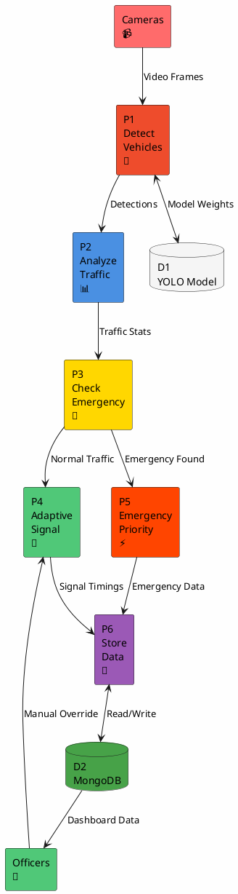

---

## 6. 📦 BLOCK DIAGRAM - System Architecture

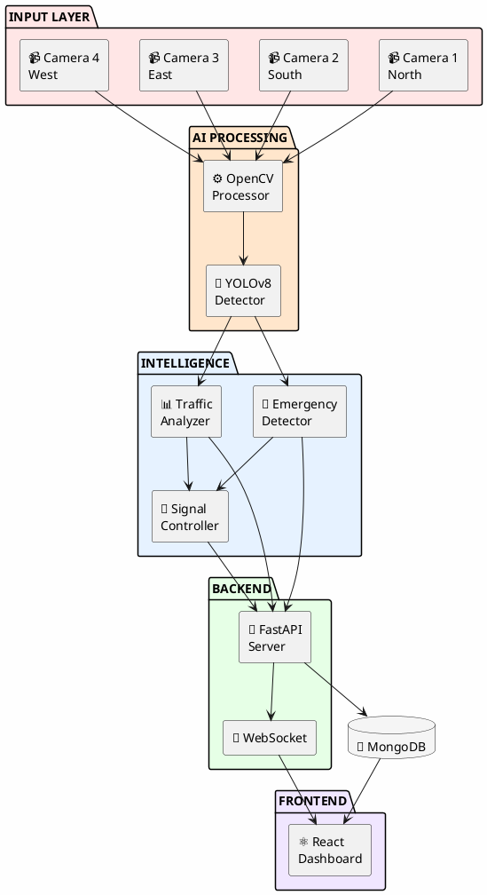

---

## 7. 🗄️ DATABASE DIAGRAM (Simplified ER)

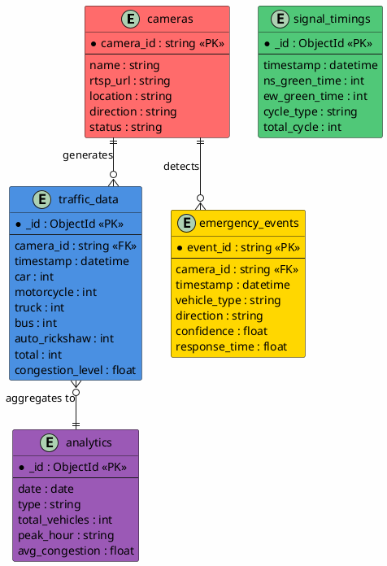

---

## 8. 🎨 UI FLOWCHART - User Navigation

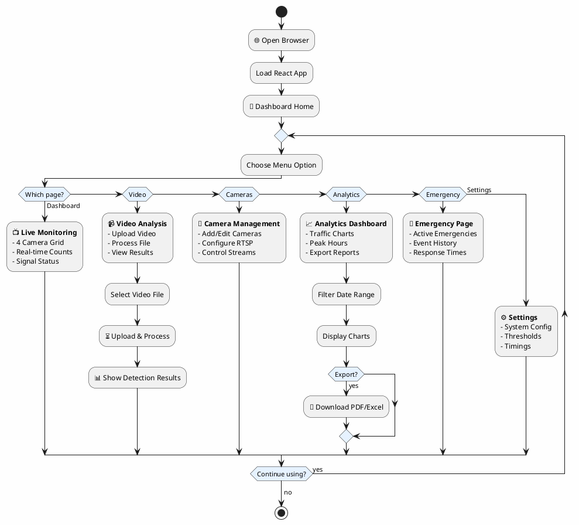

---

## 9. 🏗️ CLASS DIAGRAM - Core Models

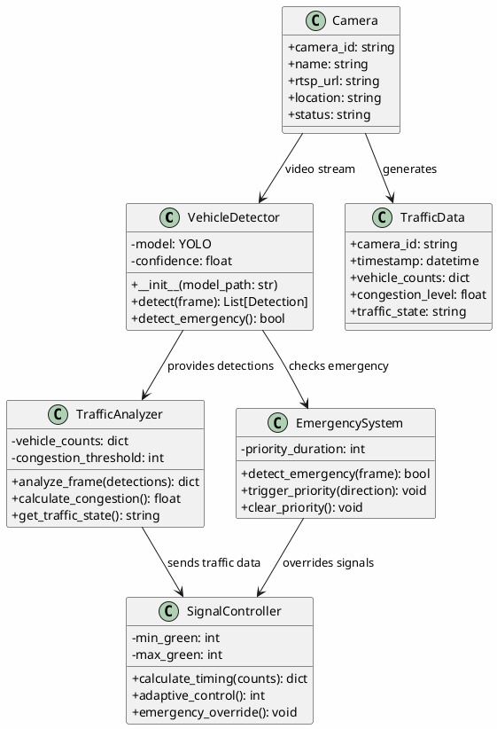

---

## 10. 🔀 ACTIVITY DIAGRAM - Traffic Processing Flow

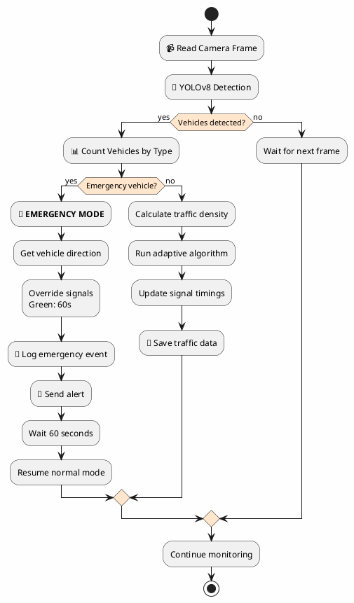

---

## 11. 🚀 DEPLOYMENT DIAGRAM (Simplified)

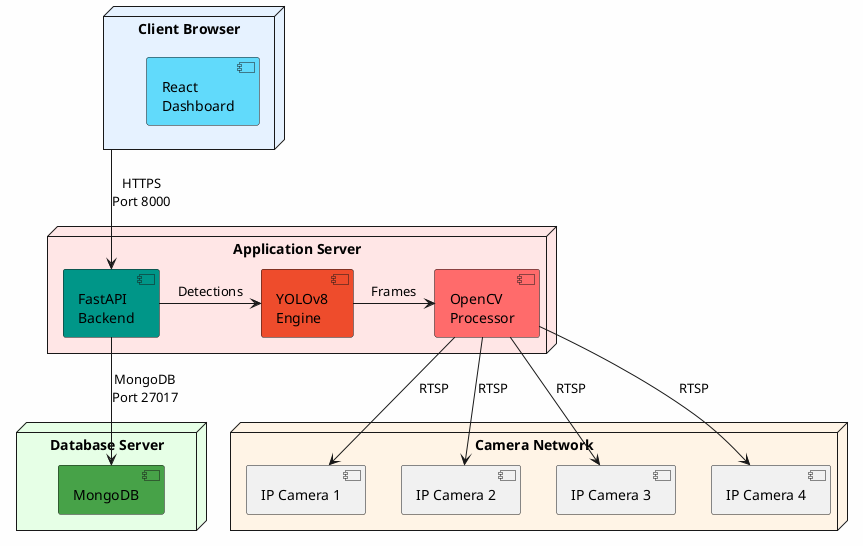

---

## 12. 📊 COMPONENT DIAGRAM - System Components

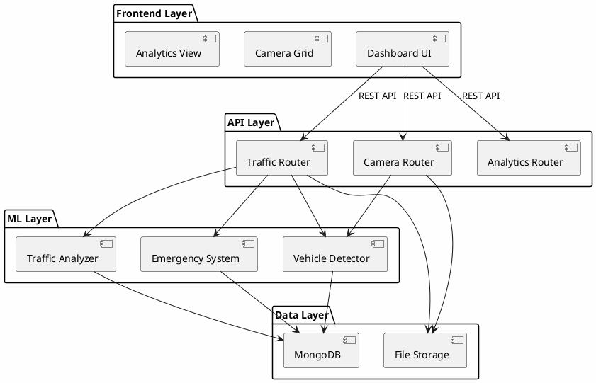

---

## 13. 🎯 STATE DIAGRAM - Traffic Signal States

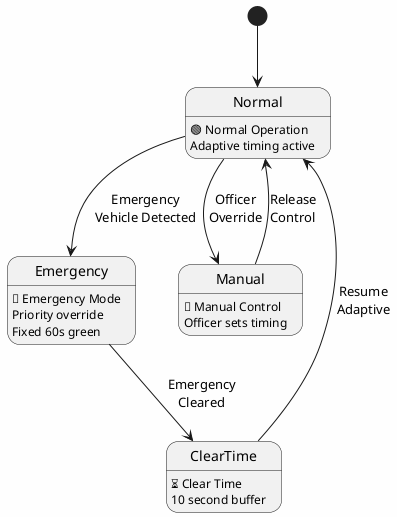

---

## 🚀 HOW TO USE

### **Online (Easiest)**
1. Go to: http://www.plantuml.com/plantuml/
2. Copy any diagram code above
3. Paste into the text box
4. Click "Submit"
5. Download as PNG or SVG

### **VS Code**
1. Install extension: "PlantUML"
2. Create a `.puml` file
3. Paste diagram code
4. Press `Alt+D` to preview
5. Right-click → Export to PNG/SVG

### **Command Line**
```bash
# Install PlantUML
npm install -g node-plantuml

# Generate diagram
puml generate diagram.puml -o output.png
```

### **Python Script**
```python
from plantuml import PlantUML

server = PlantUML(url='http://www.plantuml.com/plantuml/img/')
server.processes_file('diagram.puml')
```

---

## 📝 CUSTOMIZATION TIPS

### Change Colors
```plantuml
skinparam backgroundColor #FEFEFE
skinparam componentStyle rectangle
participant "Name" as alias #FF0000  ' Red background
```

### Add Notes
```plantuml
note right of Component
  This is an important
  component that handles
  vehicle detection
end note
```

### Style Arrows
```plantuml
skinparam sequenceArrowThickness 2
skinparam roundcorner 10
A -> B : normal
A ->> B : async
A --> B : return
A ..> B : dotted
```

---

## 📊 DIAGRAM SUMMARY

| Diagram | Purpose | Complexity |
|---------|---------|------------|
| Sequence (Emergency) | Emergency flow | ⭐⭐ Simple |
| Sequence (Upload) | Video processing | ⭐⭐ Simple |
| Use Case | Actor interactions | ⭐ Very Simple |
| DFD Level 0 | Context diagram | ⭐ Very Simple |
| DFD Level 1 | Process flows | ⭐⭐ Simple |
| Block Diagram | System architecture | ⭐⭐ Simple |
| Database ER | Data structure | ⭐⭐ Simple |
| UI Flowchart | User navigation | ⭐⭐⭐ Medium |
| Class Diagram | Code structure | ⭐⭐ Simple |
| Activity Diagram | Process flow | ⭐⭐ Simple |
| Deployment | Infrastructure | ⭐⭐ Simple |
| Component | System parts | ⭐⭐ Simple |
| State Diagram | Signal states | ⭐ Very Simple |

All diagrams are simplified for clarity and easy understanding! 🎨

---

**Created**: November 27, 2024  
**Format**: PlantUML  
**Render**: http://www.plantuml.com/plantuml/
